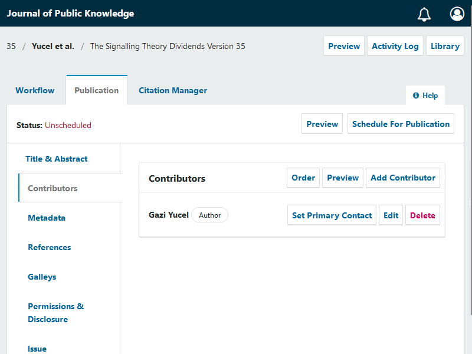

# Research Organization Registry (ROR) Plugin

- [Research Organization Registry (ROR) Plugin](#research-organization-registry-ror-plugin)
- [Features](#features)
- [Screenshot(s) / screen recording(s)](#screenshots--screen-recordings)
- [Installation](#installation)
- [Development](#development)
- [Contribute](#contribute)
- [License](#license)

OJS 3 Plugin for adding Organization names for author affiliations provided by [ROR.org](https://ror.org/)
Organizations maintained by ROR.org are automatically fetched using an auto suggesting function.
For multilingual journals, additionally supported languages will be pre-filled given, [ROR.org](https://ror.org/) has the corresponding names in the OJS supported languages.
If organization names are not present, the default name will be used.

ROR ID is integrated in the OJS reader interface up from OJS 3.3.
ROR Plugin is shipped with the OJS Plugin gallery up from OJS 3.2. For Installation of OJS 3.2 reader interface support see [installation](#Installation).

[](https://www.repostatus.org/#active)

# Features

* Allows auto-suggesting organization names
* Pre-fills affiliations in multilingual context
* Subsequent alteration of the ROR-suggested organization name is also possible by maintaining the ROR Plugin,
  which can be helpful in special cases e.g. adding a institute name for a research organization.
* OJS 3.3 compatibility
* OpenAire / Datacite / Crossref Support
* Support for user affiliations
* Usability requests specially for dissemination plugins
* Multilingual organization support
* OJS 3.4 compatibility

# Screenshot(s) / screen recording(s)

### Adding the ROR organization name into your author affiliation.



## Installation

* Login as admin or Journal manager
* Select _Settings -> Website -> Plugins_
* Click On _Plugin Gallery_
* Select and click on _ROR Plugin_
* Click _Install_ in the opened modal and wait for the _installation_ to finish.
* Click on _Enable_ button . ROR Plugin is installed under generic plugins.

**This step is _`only`_ required, if your OJS 3.2 is prior to `30.11.2020` or your are _`not`_ using `default theme`**

 * Select _templates/frontend/objects/article_details.tpl_
 * Find the following code in the template.
 ```xml
<span class="affiliation">
    {$author->getLocalizedData('affiliation')|escape}
</span>
```
* Add the ROR Icon template variable
```xml
<span class="affiliation">
    {$author->getLocalizedData('affiliation')|escape}
    {if $author->getData('rorId')}
        <a href="{$author->getData('rorId')|escape}">{$rorIdIcon}</a>
    {/if}
</span>
```

# Development
- https://github.com/withanage/

## Contributions
- https://github.com/GaziYucel/
- https://github.com/YvesLepidus
- https://github.com/JhonathanLepidus
- https://github.com/mhvezina

# Contribute

- Fork the repository
- Make your changes
- Open a PR with your changes

# License

This project is published under GNU General Public License, Version 3.

